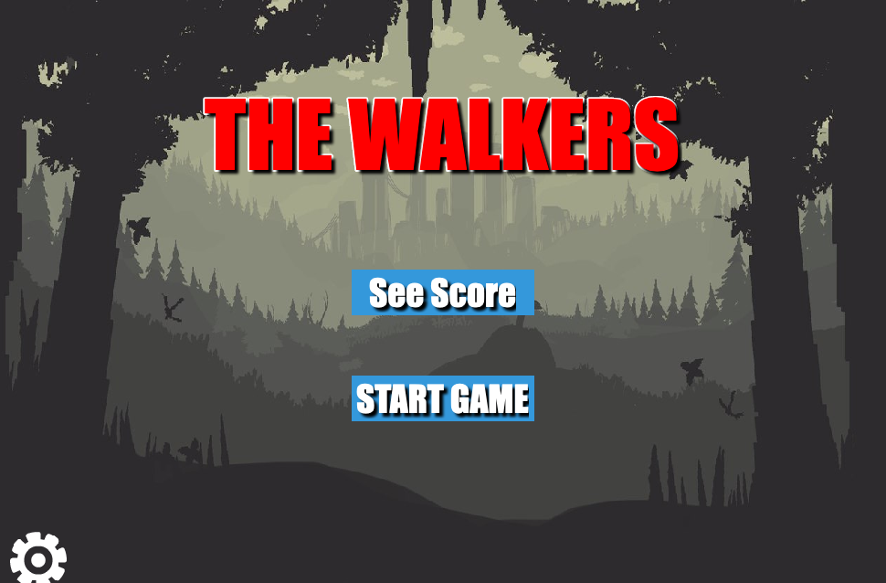
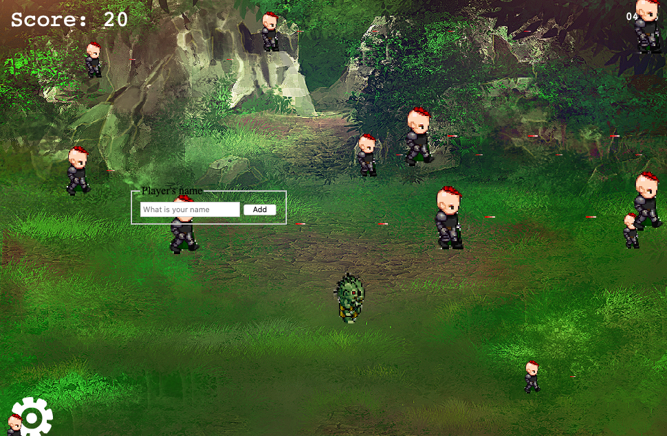
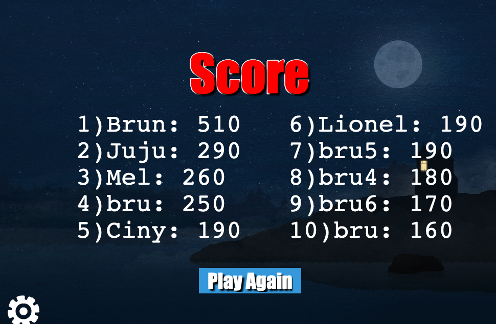
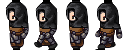
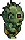
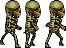
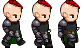

# THE WALKERS

> This is a desktop shoot game implemented it using Phaser. For developing the game, I used JavaScript and Phaser 3 along with Express to host it on gh-pages. I implemented an API provided by [Microverse Program](https://www.microverse.org/) to host the scoring database so that the highest scores will always be available for new users to try to beat! The API implementation required the use of promises and Async functions. I also used Classes and Modules to integrate everything in an industry-standard code style while implementing JavaScript, HTML, and CSS best practices.

## Scenes

### Title Scene



### Main Scene



### Game Over Scene


### Score Scene



## Built With

### Developing tools

- JavaScript
- Phaser 3
- Node.js
- Webpack
- Babel
- HTML 5
- CSS
- Github
- API

### Testing Tools

- Jest
- Babel

### Styling and Lints

- Eslint
- Stylelint

### Deployment

- GitHub Pages

## Live Demo

- [Link Demo](https://brugobi.github.io/phaser-capstone/);

### Prerequisites

- Node. If you do not have Node installed in your local machine, please refer to the [Official Documentation](https://nodejs.org/en/download/);
- Any Brownser;


To get started open the directory where you will save this repo by typing on your terminal:

```
$ cd <directory>
```

- Clone the repo typing:

```
$ git clone git@github.com:brugobi/phaser-capstone.git
```

- Install dependencies:

```
$ npm install
```
### Usage

Start the server:

```
$ npm run start
```

Open `http://localhost:3000/` in your browser.

## Game Design Document

This game is inspired by the TV Show serie *The walking dead* and here you are the hero and you fight to stay alive from the attacks of zombies and bad people, for that you have the ability to shoot them, but you have to be careful because you can die if they shoot you first or touch you. You also have just 5 minutes to beat the highest scores.

### You (the hero)



### chasing zombies



### skeleton zombies



### snipers



### Controls

- A key => Move left.
- D key => MOve right.
- W key => Move up.
- S key => Move down.
- Space key => shoot.

### Templates


To create the game I used two different templates. The phaser 3 one that you can find here created by [Richard Davey](https://github.com/photonstorm/phaser3-project-template) and one created by Willian Clarkson that helped me with some functionalities. Ckeck out his [website](https://williamclarkson.net) and support if possible! Big cheers to the amazing creators.

### Design Credits


- The backgrounds images, the skeleton zombies, and the chasing zombies used is avaible for free on [Open Game Art](https://opengameart.org);
- The hero and the sniper used were design by me using the tool [Character Generator](http://gaurav.munjal.us/Universal-LPC-Spritesheet-Character-Generator/);
- The walking dead Original Soundtrack Theme All rights reserved ! The use of its property is solely for educational purposes.

## Testing

- If you would like to run the tests yourself, please on the root directory run:

```
npm run test
```


## Author

👤 **Bruna Gobi**

- Github: [@brugobi](https://github.com/brugobi)
- Twitter: [@BrunaGobi2](https://twitter.com/BrunaGobi2)
- Linkedin: [bruna-gobi](https://www.linkedin.com/in/bruna-gobi/)

## 🤝 Contributing

Contributions, issues and feature requests are welcome!

## Show your support

Give a ⭐️ if you like this project!
Feel free to check the [issues page](issues/).

## Acknowledgments

- Project requested by [Microverse Program](https://www.microverse.org/).

## 📝 License

This project is [MIT](lic.url) licensed.
