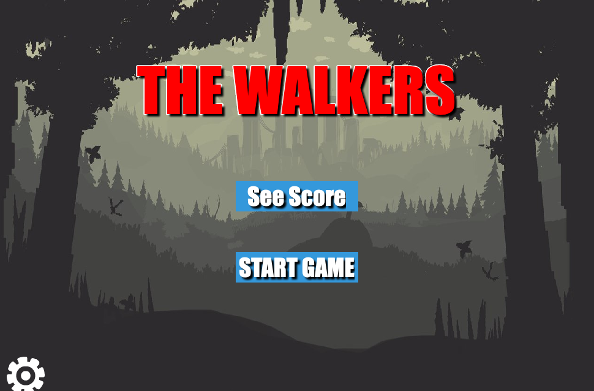
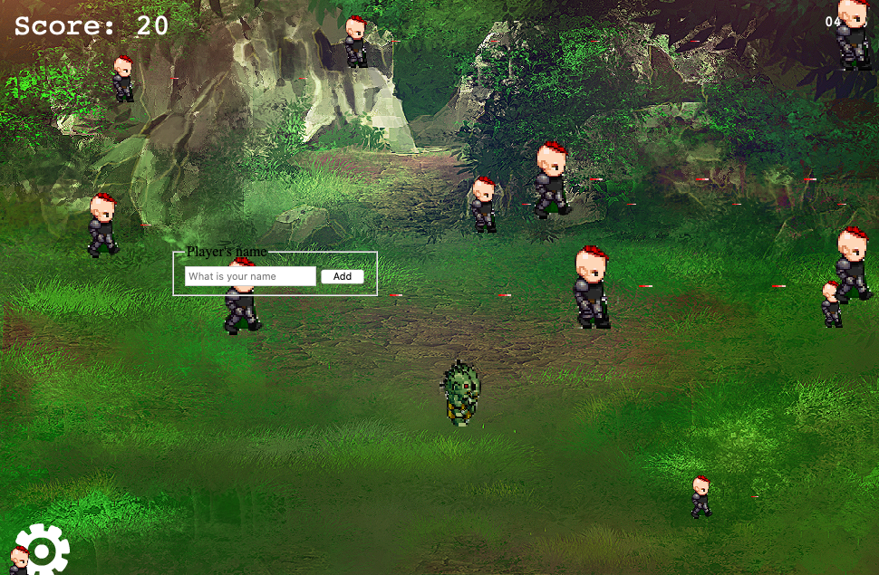
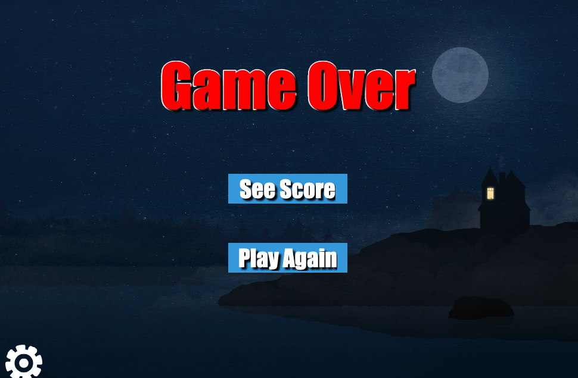
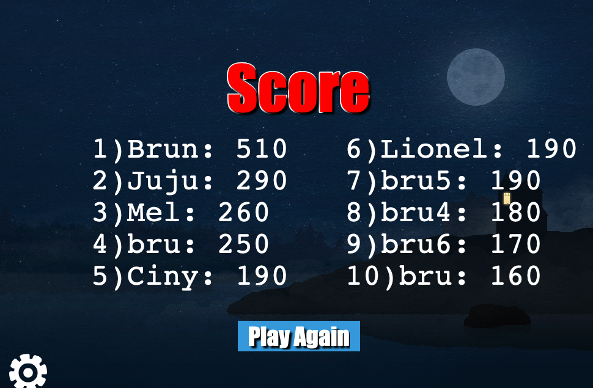
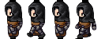
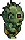
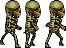
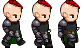

# THE WALKERS

> This is a desktop game implemented it using Phaser.

## Presentation

- [Presentation](https://www.loom.com/share/da340ec376f9427eb8c50b7ac5867aa4);

## Scenes

### Title Scene



### Main Scene



### Game Over Scene



### Score Scene



## Built With

- JavaScript
- Node.js
- Webpack
- Babel
- CSS
- Phaser

To get started open the directory where you will save this repo by typing on your terminal:

```
$ cd <directory>
```

- Clone the repo typing:

```
$ git clone git@github.com:brugobi/phaser-capstone.git
```

- Install dependencies:

```
$ npm install
```
### Usage

Start the server:

```
$ npm run server
```

Open `http://localhost:8080/` in your browser.

## Game Design Document

This game is inspired by the TV Show serie *The walking dead* and here you are the hero and you fight to stay alive from the attacks of zombies and bad people, for that you have the ability to shoot them, but you have to be careful because you can die if they shoot you first or touch you.

### You (the hero)



### chasing zombies



### skeleton zombies



### snipers



### Controls

- A key => Move left.
- D key => MOve right.
- W key => Move up.
- S key => Move down.
- Scape key => shoot.

### Templates


To create the game I used two different templates. The phaser 3 one that you can find here created by [Richard Davey](https://github.com/photonstorm/phaser3-project-template) and one created by Willian Clarkson that helped me with some functionalities. Ckeck out his [website](https://williamclarkson.net) ! Big cheers to the amazing creators.

### Design Credits


- The backgrounds images, the skeleton zombies, and the chasing zombies used is avaible for free on [Open Game Art](https://opengameart.org);
- The hero and the sniper used were design by me using the tool [Character Generator](http://gaurav.munjal.us/Universal-LPC-Spritesheet-Character-Generator/);
- The walking dead Original Soundtrack theme All rights reserved !


## Author

👤 **Bruna Gobi**

- Github: [@brugobi](https://github.com/brugobi)
- Twitter: [@BrunaGobi2](https://twitter.com/BrunaGobi2)
- Linkedin: [bruna-gobi](https://www.linkedin.com/in/bruna-gobi/)

## 🤝 Contributing

Contributions, issues and feature requests are welcome!

## Show your support

Give a ⭐️ if you like this project!
Feel free to check the [issues page](issues/).

## Acknowledgments

- Project requested by [Microverse Program](https://www.microverse.org/).

